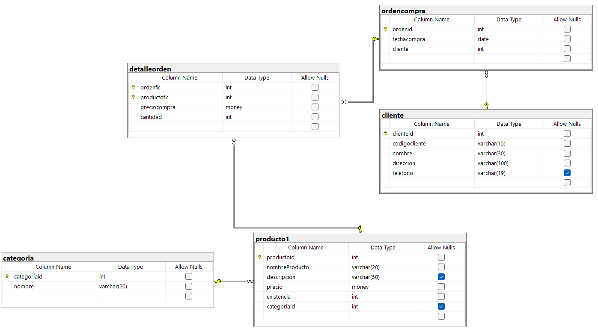

# Ejercicio de Creación de Base de Datos con SQL-LDD

``` sql

--Creacion de la BD de tienda1

--Crea la BD de tienda1

CREATE DATABASE tienda1;

--Utilizar una BD

USE tienda1;

--SQL LDD
--Crear tabla categoria

CREATE TABLE categoria(
categoriaid int not null,
	nombre varchar (20) not null,
	constraint pk_categoria
	primary key (categoriaid),
	constraint unico_nombre
	unique (nombre)
);

--SQL LMD
--Agregar registros a la tabla categoria

INSERT INTO categoria
VALUES (1, 'Carnes Frias');

INSERT INTO categoria(categoriaid, nombre)
VALUES (2, 'Linea Blanca');

INSERT INTO categoria(nombre, categoriaid)
VALUES ('Vinos y Licores', 3);

INSERT INTO categoria
VALUES (4, 'Ropa'),
       (5, 'Dulces'),
	   (6, 'Lacteos');

INSERT INTO categoria(nombre, categoriaid)
VALUES ('Panaderia', 7),
       ('Zapateria', 8),
	   ('Jugueteria',9);

SELECT * FROM categoria;

--Tabla productos
CREATE TABLE producto1(
	productoid int not null,
	nombreProducto varchar (20) not null,
	descripcion varchar (50) null,
	precio money not null,
	existencia int not null,
	categoriaid int null,
	constraint pk_producto1
	primary key (productoid),
	constraint unico_descripcion
	unique (nombreProducto),
	constraint chk_precio
	check (precio>0.0 and precio<=1000),
	constraint chk_existencia
	check (existencia>0 and existencia<=200),
	constraint fk_categoria_producto1
	foreign key (categoriaid)
	references categoria(categoriaid)
)

SELECT * FROM categoria

INSERT INTO producto1
values (1, 'Miguelito', 'Dulce sano para la lombriz', 34.5, 45, 5);

select * from producto1
where categoriaid=5

--Identity se usa para autoincremento ((Dónde empieza),(Cuánto incrementa))
CREATE TABLE cliente(
	clienteid int not null identity (1,1),
	codigocliente varchar (15) not null,
	nombre varchar (30) not null,
	direccion varchar (100)not null,
	telefono varchar (19),
	constraint pk_cliente
	primary key (clienteid),
	constraint unico_codigocliente
	unique (codigocliente)
);

CREATE TABLE detalleorden(
	ordenfk int not null,
	productofk int not null,
	preciocompra money not null,
	cantidad int not null,
	constraint pk_detalleorden
	primary key (ordenfk, productofk),
	constraint chk_preciocompra
	check (preciocompra > 0.0 and preciocompra <= 20000),
	constraint chk_cantidad
	check (cantidad >0),
	constraint fk_detalleorden_producto
	foreign key (productofk)
	references producto1(productoid)
);

CREATE TABLE ordencompra(
	ordenid int not null identity (1,1),
	fechacompra date not null,
	cliente int not null,
	constraint pk_ordencompra
	primary key (ordenid),
	constraint fk_ordencompra_cliente
	foreign key (cliente)
	references cliente (clienteid),
);

ALTER table detalleorden
add constraint fk_detalleorden_orden
foreign key (ordenfk)
references ordencompra (ordenid);
```

# Diagrama Resultante
